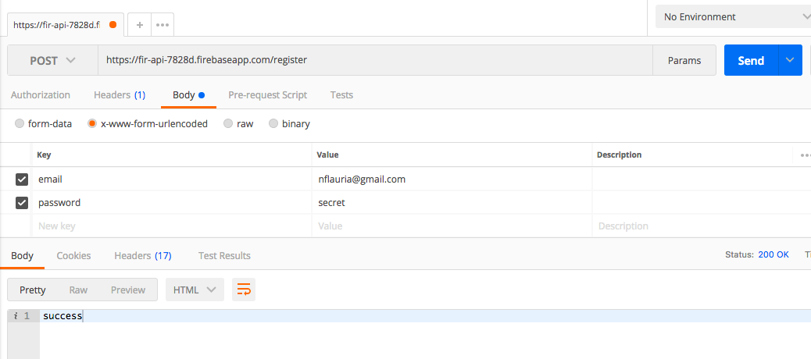

## firebaseAPI
api for fetching user records from a large database. api requests are made
in batches (50 at a time). The api uses firebase and express. Requests are
made secure with the use of passport and jsonwebtokens. There are currently 1000
users in the database if you would like to test the api.

The screenshots below show the api being tested with Postman.

### routes
**/register** 
Register a new user to make api requests

**/login** 
Login the user to get security a token. Copy the security token returned (including
the Bearer portion).

**/api/users/:userId** 
Query the database with a user id. (add a header to the request in Postman called 'Authorization' and paste the token in the value field). The api orders the users
based off their createdAt timestamp. The startAfter method is used to determine which user to begin the query with. The query returns a json object containing the 50 users. The user id of the last user is then used to get the next 50 users.

index.js (line 117)
``
users.orderBy("createdAt").startAfter(user).limit(50).get()
``

Note: The first query uses the user id 'beginUser' to fetch the first 50 users:

Subsequent api requests use the id of the last user in the first request.

